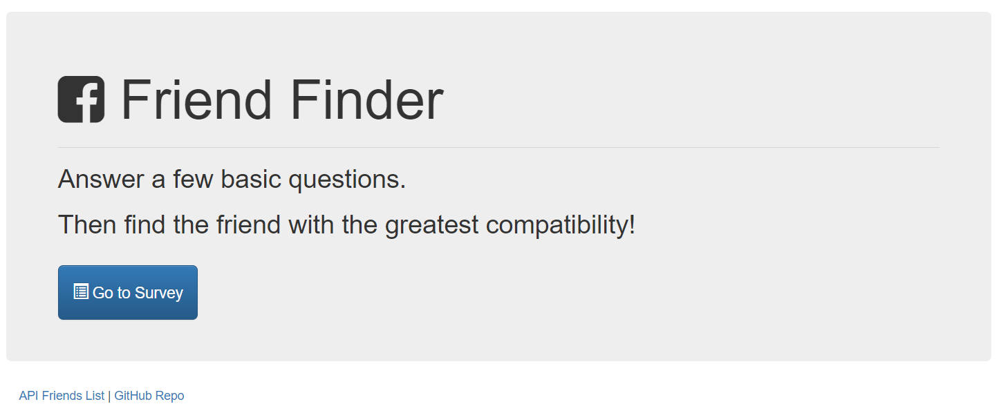

# :busts_in_silhouette: FriendFinder
## Full Stack Application

The Friend Finder application is basically a dating app, but for makin' new buddies. This full-stack site will take in users' surveys, then compare their answers with those from other users. The app will then display the name and picture of the user with the best overall match.

### Link to App
* <strong>[FriendFinder](https://ancient-reef-11912.herokuapp.com/)</strong>

### Functionality
  1. <strong>Survey</strong> FriendFinder asks the user to answer 10 questions about their personality.  The new user information is posted in a mySql database.  
  2. <strong>How are matches made?</strong> Once the new user data is stored in the database, the app performs a JS algorithm to determine which of existing users in the database makes the best match.  
  3. <strong>Your Match!</strong> The perfect match for you is displayed on the page along with a photo.  I hope you like your match!

### Technologies
* JavaScript
* Node/express
* JSON data

### Screenshot

